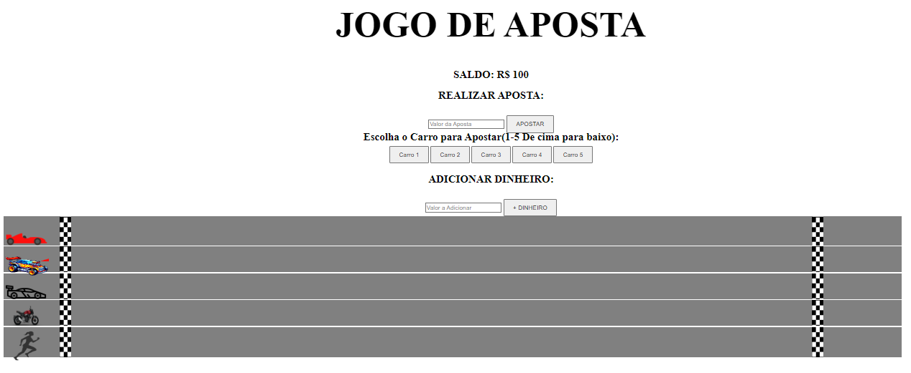

# APOSTA DE CORRIDA
👨‍💻JOGO DE APOSTA DE CORRIDA COM HTML, CSS E JS.

  

## DESCRIÇÃO:
O jogo é uma corrida de carros onde o jogador faz apostas em qual carro (de 1 a 5) ele acha que será o vencedor da corrida. O objetivo é apostar em um carro e, se ele vencer a corrida, o jogador ganhará um prêmio baseado na aposta feita.

## COMO O JOGO FUNCIONA?
- **Movimentação dos Carros**:
  - A cada intervalo de 50 milissegundos, a função `velocidade` é chamada para atualizar a posição dos carros. A posição dos carros é incrementada aleatoriamente para simular a corrida.
  
- **Detecção do Vencedor**:
  - A função `determinarVencedor` verifica qual carro alcançou a linha de chegada e define o vencedor. O saldo do jogador é atualizado com base no resultado da aposta.

- **Reinício do Jogo**:
  - Após a corrida, a função `reiniciarCorrida` é chamada para resetar os valores e permitir uma nova aposta.

## JOGANDO:
1. **Configuração Inicial**:
   - Quando o jogo carrega, você começa com um saldo inicial de R$ 100.

2. **Escolha do Carro**:
   - Na seção "Escolha o Carro para Apostar", você pode selecionar um carro para apostar clicando em um dos botões de carro (1 a 5). O carro selecionado será o seu "carro de aposta".

3. **Realizar Aposta**:
   - Na seção "Realizar Aposta", insira o valor da aposta no campo apropriado e clique em "APOSTAR".
   - O valor mínimo para a aposta é R$ 5. Se o valor inserido for menor ou se não houver saldo suficiente, o jogo alertará você.
   - Após realizar a aposta, o valor da aposta será subtraído do seu saldo.

4. **Início da Corrida**:
   - Quando você faz uma aposta válida, a corrida começa automaticamente. Os carros começarão a se mover em direção à linha de chegada.

5. **Corrida dos Carros**:
   - Os carros se movem aleatoriamente em intervalos regulares. O progresso dos carros é atualizado na tela.

6. **Resultado da Corrida**:
   - A corrida termina quando um dos carros alcança ou ultrapassa a linha de chegada.
   - O vencedor é determinado e o resultado é mostrado. Se o carro escolhido por você for o vencedor, você ganha o dobro do valor apostado.
   - Caso contrário, você perde a aposta e o saldo não é atualizado.

7. **Adicionar Dinheiro**:
   - Se desejar, você pode adicionar mais dinheiro ao seu saldo usando a seção "Adicionar Dinheiro". Insira o valor e clique em "+ DINHEIRO" para aumentar o saldo.

8. **Reiniciar Corrida**:
   - Após cada corrida, o jogo é reiniciado, e você pode fazer novas apostas e começar novamente.

## NÃO SABE?
- Entendemos que para manipular arquivos em `HTML`, `CSS` e outras linguagens relacionadas, é necessário possuir conhecimento nessas áreas. Para auxiliar nesse aprendizado, oferecemos cursos gratuitos disponíveis:
* [CURSO DE HTML E CSS](https://github.com/VILHALVA/CURSO-DE-HTML-E-CSS)
* [CURSO DE JAVASCRIPT](https://github.com/VILHALVA/CURSO-DE-JAVASCRIPT)
* [CONFIRA MAIS CURSOS](https://github.com/VILHALVA?tab=repositories&q=+topic:CURSO)

## CREDITOS:
- [PROJETO CRIADO PELO "jrodrigues22"](https://github.com/jrodrigues22/JogoCorrida)
- [PROJETO EDITADO PELO VILHALVA](https://github.com/VILHALVA)
